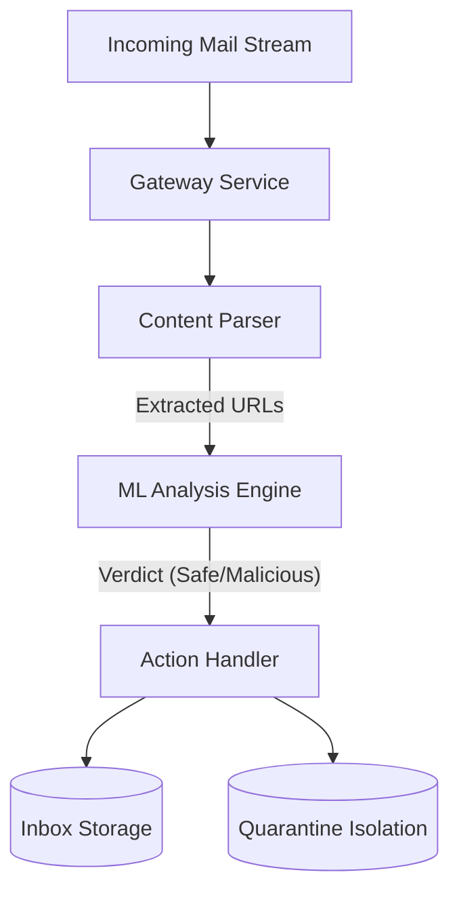

# System Design Document: AI-Powered Email Shield

## 1. Executive Summary
The **Email Shield** is an automated security middleware designed to intercept and neutralize phishing threats before they reach end-users. Unlike traditional blacklist-based filters, this system utilizes a **Random Forest Machine Learning** model to perform real-time heuristic analysis of URL structures, enabling the detection of Zero-Day phishing campaigns.

## 2. System Architecture

### 2.1 High-Level Overview
The system follows a micro-service architecture pattern, consisting of three primary components:
1.  **Gateway Service**: The entry point that monitors traffic (File System/Mail Server).
2.  **Analysis Engine**: Neural core that extracts features and processes logic.
3.  **Action Handler**: Deterministic system that routes entities based on verdict.

### 2.2 Component Design

#### A. The Monitor (Gateway)
-   **Responsibility**: File System Watcher.
-   **Implementation**: Polling loop (Current) -> scalable to Webhook/API.
-   **Fault Tolerance**: Implements try-catch blocks to prevent crashes on corrupt files.

#### B. The Brain (Feature Extractor & Model)
-   **Model Architecture**: Random Forest Classifier (Ensemble Learning).
-   **Feature Vector**:
    -   `url_length` (Int): Phishing links often exceed 54 chars.
    -   `entropy` (Float): Randomness of characters (DGA detection).
    -   `ip_usage` (Bool): Direct IP access is highly correlated with malice.
    -   `suspicious_tld` (Bool): Use of .xyz, .top, etc.

## 3. Data Flow
1.  **Ingestion**: An email file enters the `incoming/` buffer.
2.  **Parsing**: `email_parser.py` uses Regex `r'https?://...'` to strip URLs.
3.  **Inference**:
    -   URLs are passed to `PhishingPredictor`.
    -   `features.extract_features()` converts text to `[12, 0.45, 1, ...]`.
    -   `sklearn` model computes probability scores.
4.  **Disposition**:
    -   If `P(Phish) > 0.5` for ANY link -> **QUARANTINE**.
    -   Else -> **INBOX**.

## 4. Scalability & Future Considerations

| Bottleneck | Current Solution | Scaled Solution |
| :--- | :--- | :--- |
| **Ingestion** | Single File Loop | Kafka Event Stream |
| **Parsing** | Regex (CPU Bound) | Distribute to Worker Nodes (Celery) |
| **Model** | Local `.pkl` file | REST API (FastAPI) on Kubernetes |

## 5. Security Considerations
-   **Model Poisoning**: The training set must be sanitized to prevent adversaries from training the model to ignore specific patterns.
-   **Evasion Attacks**: Phishers may use URL Shorteners. *Mitigation*: Implement a "Unshortener" service to resolve redirects before analysis.

## 6. Technology Stack
-   **Data Processing**: Pandas, NumPy

## 7. Real-World Integration Strategies

To deploy this system in an enterprise environment (e.g., a Fortune 500 company), it would not run as a local script. Instead, it would be integrated via one of the following patterns:

### A. API-Based Protection (Microsoft 365 / Google Workspace)
*   **Method**: Post-Delivery / Pre-Read scanning.
*   **Implementation**:
    1.  Register an Enterprise App in Azure AD / Google Cloud Console.
    2.  Use **Microsoft Graph API** (`/v1.0/users/{id}/messages`) or **Gmail API** to subscribe to webhook notifications for new emails.
    3.  When a webhook fires, our system fetches the email body via API.
    4.  If `PhishingPredictor` returns Malicious, use the API to move the message to the "Junk" folder or hard-delete it.
*   **Pros**: No network changes required; easy to deploy.

### B. Secure Email Gateway (SEG) / SMTP Relay
*   **Method**: Pre-Delivery scanning.
*   **Implementation**:
    1.  Configure the organization's MX records to point to a **Postfix/Sendmail** cluster running our software.
    2.  The `Gateway Service` acts as a "Milter" (Mail Filter) plugin.
    3.  Emails are held in a memory buffer.
    4.  Safe emails are forwarded to the actual Exchange/Gmail server.
    5.  Phishing emails are rejected with a 550 Error code.
*   **Pros**: Blocks threats before they ever touch the employee's mailbox.

### C. Security Orchestration (SOAR)
*   **Method**: Incident Response.
*   **Implementation**:
    1.  Integrate with handling platforms like **Splunk Phantom** or **Palo Alto XSOAR**.
    2.  When a user reports a suspicious email, the SOAR platform triggers our `predict_urls` function.
    3.  If confirmed malicious, the SOAR platform automatically purges that same URL from *all* other employee mailboxes.

## 8. Future Security Roadmap (Hardening Strategy)

To counter evolving threats (e.g., AI-generated phishing, "scandalous" content), the system can be upgraded with these high-value defenses:

### A. Advanced URL & Domain Analysis
1.  **Link Unshortening**: Recursively resolve redirects (e.g., `bit.ly` -> `malicious.site`) before analysis to prevent evasion.
2.  **Homograph Attack Detection**: Detect "Typosquatting" (e.g., `g0ogle.com` or Cyrillic `a` in `paypal.com`) using Levenshtein distance against a whitelist of top brands.
3.  **Domain Age Checks**: Query WHOIS data. Domains registered < 24 hours ago are 99% likely to be malicious.

### B. Content & Context Analysis (beyond just URLs)
1.  **NLP for Urgency Detection**: Use BERT/Transformers to flag high-pressure language ("URGENT", "Legal Action", "Account Suspended").
2.  **Logo Recognition (Computer Vision)**: Render the target URL in a headless browser and scan for stolen banking logos on non-banking domains.

### C. Threat Intelligence Integration
1.  **Real-Time API Lookups**: Cross-reference URLs with **VirusTotal**, **Google Safe Browsing**, or **AbuseIPDB** API for known blacklists.
2.  **Scandalous/NSFW Filters**: Integrate with content moderation APIs (like AWS Rekognition) to detect and block "scandalous" or adult imagery.

## 9. Analytics & Reporting Architecture

To provide organization-wide visibility and "User Behavior Analytics" (UBA), we will implement a centralized logging and dashboard layer.

### A. Data Persistence (The Audit Log)
Instead of ephemeral logs, every decision is written to a structured database (`audit_log.db` or **Elasticsearch**).
-   **Schema**:
    -   `timestamp`: When the email arrived.
    -   `user_email`: Who received it (Extracted from "To:" header).
    -   `verdict`: "Safe" or "Phishing".
    -   `threat_confidence`: 0-100% score from the AI.

### B. The Executive Dashboard (Visualization)
A generic web interface (built with **Streamlit** or **Kibana**) connects to the database to answer key questions:
1.  **Threat Landscape**: Pie Chart showing % of Phishing vs. Safe traffic.
2.  **High-Risk Users**: "Top 10 Most Targeted Employees" bar chart.
    -   *Why*: Identifies who needs extra security training.
3.  **breach Analysis**: A filterable table allowing the security team to drill down by `user_name` to see exactly which link they clicked.
