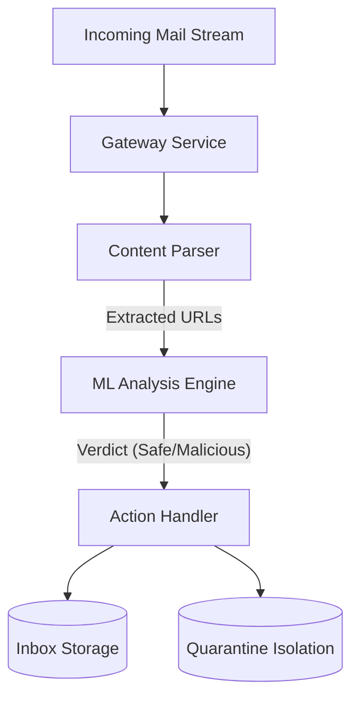

# System Design Document: AI-Powered Email Shield

## 1. Executive Summary
The **Email Shield** is an automated security middleware designed to intercept and neutralize phishing threats before they reach end-users. Unlike traditional blacklist-based filters, this system utilizes a **Random Forest Machine Learning** model to perform real-time heuristic analysis of URL structures, enabling the detection of Zero-Day phishing campaigns.

## 2. System Architecture

### 2.1 High-Level Overview
The system follows a micro-service architecture pattern, consisting of three primary components:
1.  **Gateway Service**: The entry point that monitors traffic (File System/Mail Server).
2.  **Analysis Engine**: Neural core that extracts features and processes logic.
3.  **Action Handler**: Deterministic system that routes entities based on verdict.

### 2.2 Component Design

#### A. The Monitor (Gateway)
-   **Responsibility**: File System Watcher.
-   **Implementation**: Polling loop (Current) -> scalable to Webhook/API.
-   **Fault Tolerance**: Implements try-catch blocks to prevent crashes on corrupt files.

#### B. The Brain (Feature Extractor & Model)
-   **Model Architecture**: Random Forest Classifier (Ensemble Learning).
-   **Feature Vector**:
    -   `url_length` (Int): Phishing links often exceed 54 chars.
    -   `entropy` (Float): Randomness of characters (DGA detection).
    -   `ip_usage` (Bool): Direct IP access is highly correlated with malice.
    -   `suspicious_tld` (Bool): Use of .xyz, .top, etc.

## 3. Data Flow
1.  **Ingestion**: An email file enters the `incoming/` buffer.
2.  **Parsing**: `email_parser.py` uses Regex `r'https?://...'` to strip URLs.
3.  **Inference**:
    -   URLs are passed to `PhishingPredictor`.
    -   `features.extract_features()` converts text to `[12, 0.45, 1, ...]`.
    -   `sklearn` model computes probability scores.
4.  **Disposition**:
    -   If `P(Phish) > 0.5` for ANY link -> **QUARANTINE**.
    -   Else -> **INBOX**.

## 4. Scalability & Future Considerations

| Bottleneck | Current Solution | Scaled Solution |
| :--- | :--- | :--- |
| **Ingestion** | Single File Loop | Kafka Event Stream |
| **Parsing** | Regex (CPU Bound) | Distribute to Worker Nodes (Celery) |
| **Model** | Local `.pkl` file | REST API (FastAPI) on Kubernetes |

## 5. Security Considerations
-   **Model Poisoning**: The training set must be sanitized to prevent adversaries from training the model to ignore specific patterns.
-   **Evasion Attacks**: Phishers may use URL Shorteners. *Mitigation*: Implement a "Unshortener" service to resolve redirects before analysis.

## 6. Technology Stack
-   **Language**: Python 3.9+
-   **ML Framework**: Scikit-Learn (Random Forest)
-   **Data Processing**: Pandas, NumPy
